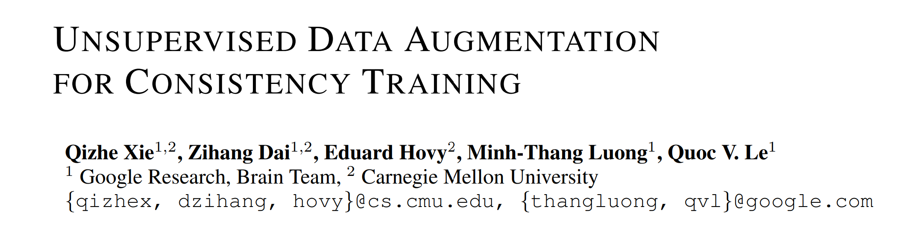

---
# Abstract

* Consistency training: to constrain model predictions to be **invariant to input noise**

|Task|Error rate|# examples|# examples (cf)|
|-|-|-|-|
|IMDb|4.20|20|25000|
|CIFAR-10|2.7|4000|50000|
|BERT|
|ImageNet|

---
# Introduction
* Consistency training methods simply regularize model predictions to be invariant to small noise applied to either input examples
* A good model should be robust to any small change in an input example or hidden states.
* The authors investigated the role of noise injection in consistency training --> **Unsupervised Data Augmentation**

---
# Contribution
• First, we show that state-of-the-art **data augmentations found in supervised learning** can also serve as a **superior source of noise under the consistency** enforcing semi-supervised framework.
• Second, we show that UDA can match and even outperform purely supervised learning that uses orders of magnitude more labeled data.
• Finally, we show that **UDA combines well with transfer learning**, e.g., when fine-tuning from BERT, and is effective at high-data regime, e.g. on ImageNet.

---
# Supervised Data Augmentation
* Data augmentation aims at creating novel and realistic-looking training data by applying a transformation to an example, without changing its label
* Despite the promising results, data augmentation
is mostly regarded as the “cherry on the cake” which provides a **steady but limited performance boost**
    * because these augmentations has so far only been applied to a set of labeled examples which is usually of a small size

---
# Unsupervised Data Augmentation
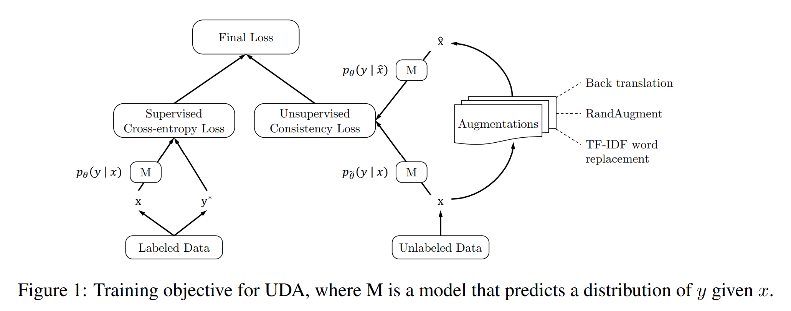
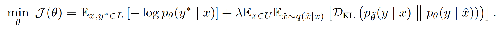

---
# Augmentation Strategies
* RandAugment for Image Classification

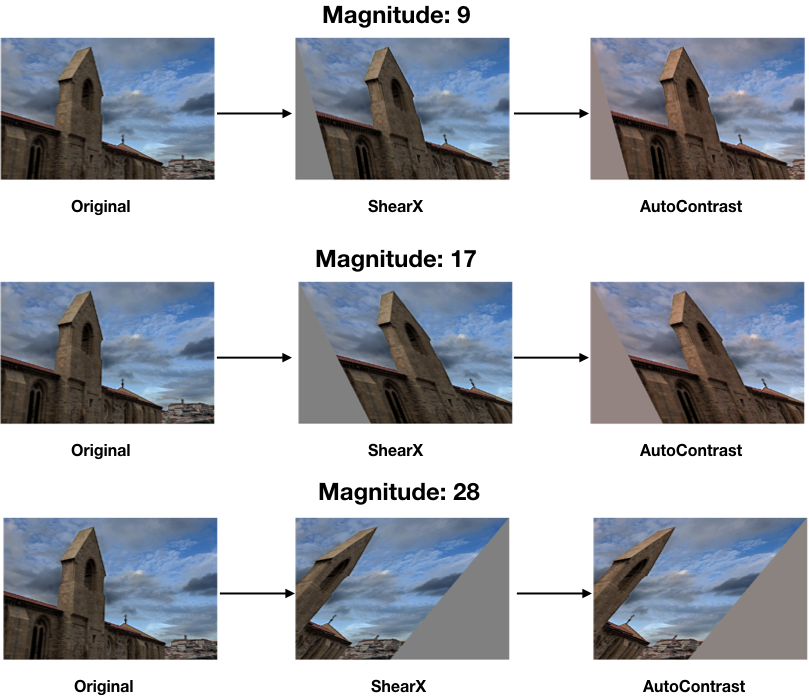

---
# Augmentation Strategies
* Back-translation for Text Classification

---
# Augmentation Strategies
* Word replacing with TF-IDF for Text Classification
    * This method replaces uninformative words with low TF-IDF scores while **keeping those with high TF-IDF values**

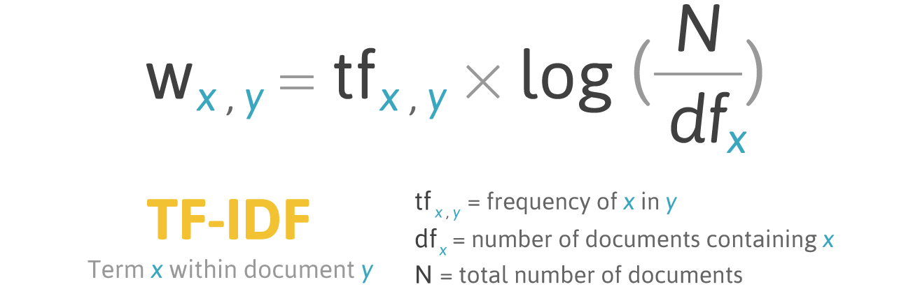

---
# Training Signal Annealing (TSA) for Low-data Regime
* the model often quickly overfits the limited amount of labeled data while still underfitting the unlabeled data
* TSA utilize a labeled example if the model's confidence on that example is **lower than a predefined threshold** which increases according to a schedule
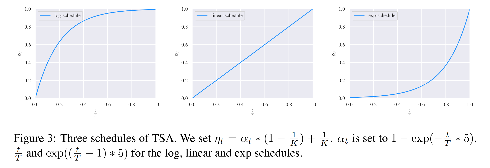

---
# Correlation between Supervised and Semi-supervised Performances
* There is a positive correlation of data augmentation’s effectiveness in supervised learning and semi-supervised learning
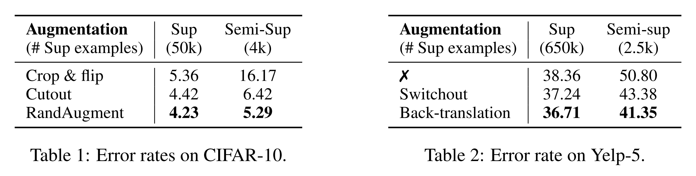

---
# Algorithm Comparison on Vision Semi-supervised Learning Benchmarks
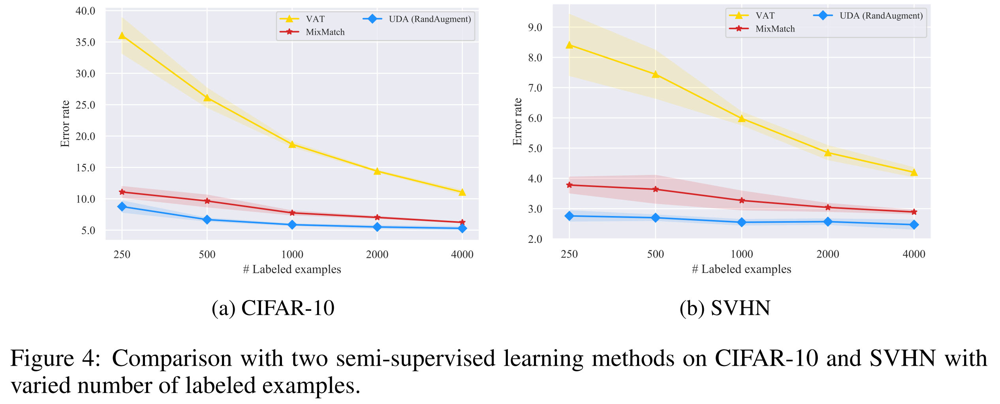
* Virtual adversarial training (VAT): an algorithm that generates adversarial Gaussian noise on input
* MixMatch: combines previous advancements in semi-supervised learning

---
# Algorithm Comparison on Vision Semi-supervised Learning Benchmarks
* Comparisons with published results
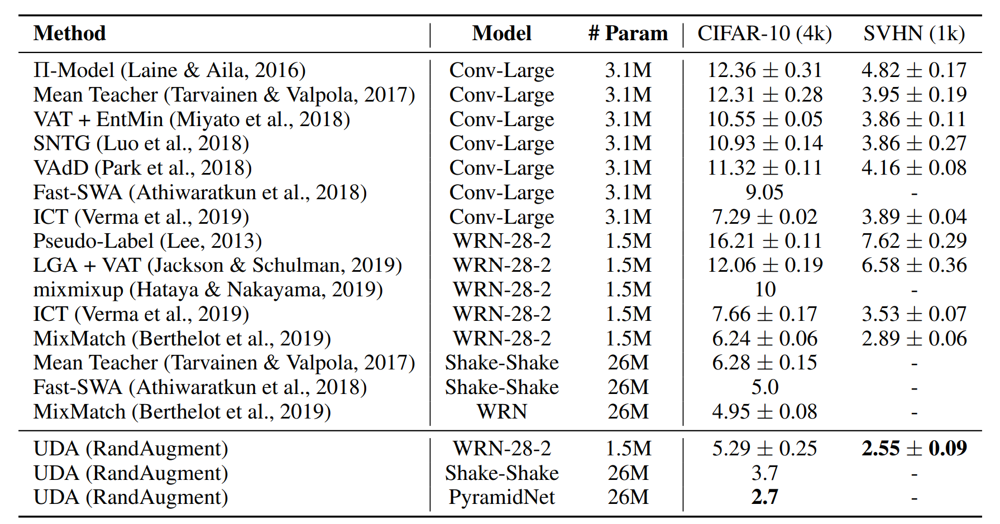

---
# Evaluation on Text Classification Datasets
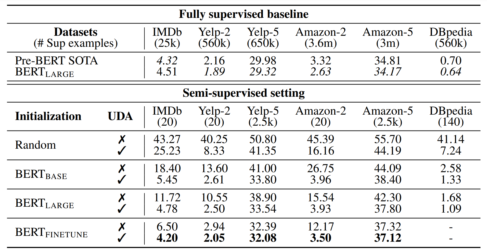

---
# Evaluation on Text Classification Datasets
* Even with very few labeled examples, UDA can offer decent or even competitive performances compared to the SOTA model trained with full supervised data. Particularly, on binary sentiment analysis tasks, with only 20 supervised examples, UDA outperforms the previous SOTA
trained with full supervised data on IMDb and is competitive on Yelp-2 and Amazon-2.
* UDA is complementary to transfer learning / representation learning. As we can see, when initialized with BERT and further finetuned on in-domain data, UDA can still significantly reduce the error rate from 6.50 to 4.20 on IMDb.
* We also note that for five-category sentiment classification tasks, there still exists a clear gap between UDA with 500 labeled examples per class and BERT trained on the entire supervised set. Intuitively, five-category sentiment classifications are much more difficult than their binary counterparts. This suggests a room for further improvement in the future. 

---
# Evaluation on Text Classification Datasets
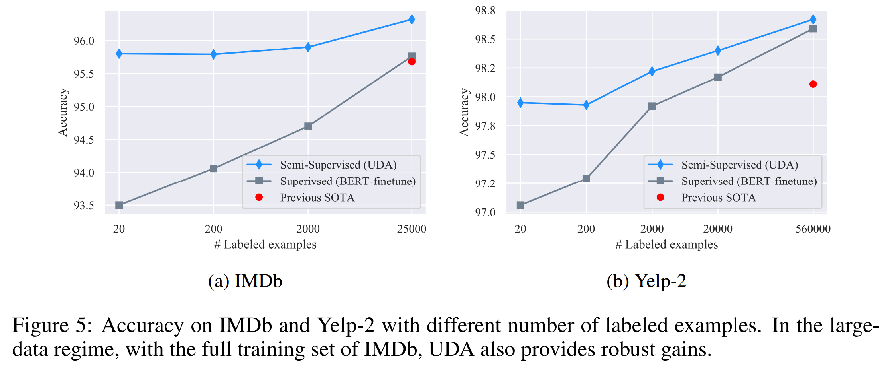

---
# Scalability Test on the ImageNet Dataset
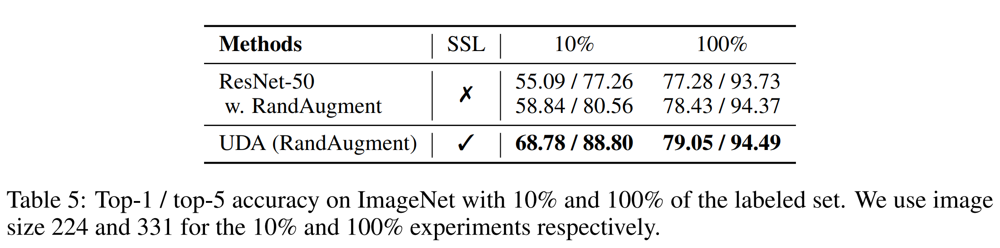

---
# Ablation Studies for TSA
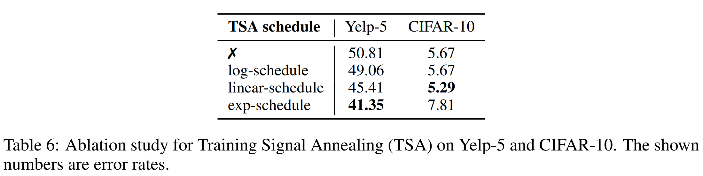